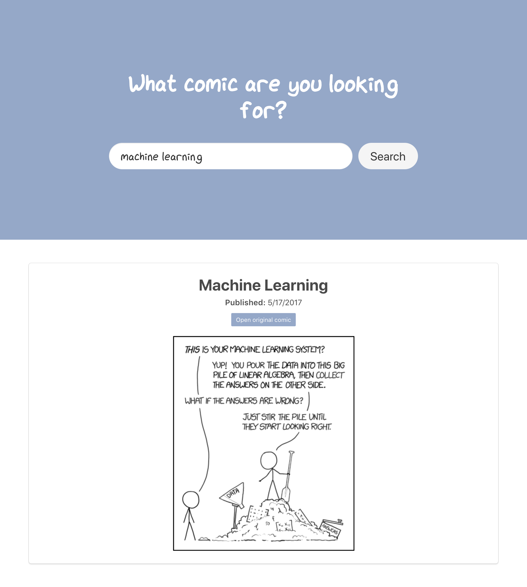

# Struktur des Workflows
Der Workflow ist in drei grundlegende Stufen eingeteilt. Die erste Stufe lädt
die Comics von XKCD herunter und bereitet das HDFS vor. Im zweiten Schritt
werden daraufhin die Daten, die von Schritt 1 bereitgestellt wurden, in Hive
eingepflegt und aufbereitet. Im selben Zuge werden auch alle für Hive
benötigten Strukturen angelegt. In der dritten und letzten Phase werden die
Daten aus Hive in eine End-User-Datenbank exportiert.  Diese Datenbank ist die
Arbeitsbasis für die Suche, die der Nutzer in einem einfachen Frontend anstoßen
kann.

## *Stage 1*: Comics herunterladen
Dieser Schritt liefert die Datengrundlage für den Rest des Workflows. Er kann
optional übersprungen werden, indem im DAG die Variable \texttt{skipDownloads}
aktiviert wird. Das Script akzeptiert ebenfalls einen Parameter, mit dem Output
Pfad des Downloads angegeben wird. Eine volle Unterstützung für die
\texttt{--help} Funktion wurde implementiert.

```
 > python3.7 crawler.py --help

usage: crawler.py [-h] [--save-raw-comics] output

The XKCD crawler can gather the current list of published comics from the XKCD
website and download their meta data for further processing.

positional arguments:
  output             the directory the comics will be saved to (the directory
                     will be created if it does not exist yet and cleaned if
                     it does)

optional arguments:
  -h, --help         show this help message and exit
  --save-raw-comics  also save the raw json files before concatenation
```

Um sicherzustellen, dass stets **alle** verfügbaren Comics heruntergeladen
werden, wird die Archiv-Seite der XKCD-Website vom Crawler geladen und
geparsed ([Link](https://xkcd.com/archive/)). So wird aktiv vermieden, dass der
Crawler versucht Metadaten von Comics herunterzuladen, deren ID einen Sprung
$>1$ zur vorherigen haben.

Die vom Crawler erstellte Datei enthält pro Zeile die Metadaten eines Comics.
Die einzelnen Zeilen sind durch \texttt{CRLF} voneinander getrennt. So kann die
Datei nativ mit dem Hive-JSON-Serde Treiber für Hive gelesen werden ([Link zu
GitHub Repository](https://github.com/rcongiu/Hive-JSON-Serde))

## *Stage 1*: HDFS Basis vorbereiten
In diesem DAG wird hier an statischer Stelle (/user/hadoop/xkcd-search) die
Grundstruktur des Projektes angelegt. Innerhalb des \texttt{xkcd-search}
Verzeichnisses wird ein \texttt{raw} Verzeichnis angelegt, welches alle
Rohdaten enthalten wird.

## *Stage 1*: HDFS Datumstruktur anlegen
Um eine langfristige Speicherung der Comics zu gewährleisten wird pro
Ausführung des DAGs im \texttt{raw} Verzeichnis eine Datumstruktur angelegt.
Sie folgt dabei dem Muster \texttt{../raw/YYYY/DD/MM/HH-MM-SS/}. So können auch
bei täglicher Ausführung des Workflows zwei Tage miteinander verglichen werden.

## *Stage 1*: Comic-Datei im HDFS platzieren
Die Datei, die im ersten Schritt des Workflows vom Crawler erstellt wurde, wird
nun in das gerade angelegte Datumverzeichnis im HDFS platziert.

## *Stage 2*: Entfernen der bisherigen Comic Tabelle in Hive
Um Kollisionen mit alten Datensätzen zu vermeiden, wird zunächst die alte
Comic-Datenbank in Hive entfernt. Dabei ist wichtig zu erwähnen, dass die
Tabelle mit dem \texttt{EXTERNAL}-Keyword erstellt wurde. Auf Grund dessen wird
bei dem Löschen der Tabelle die dahinter liegende Datei nicht aus dem HDFS
gelöscht. Dies ist vor allem aus dem Gesichtspunkt der Datenarchivierung
sinnvoll.

## *Stage 2*: Erstellen der Comic Tabelle in Hive
Nachdem die alte Tabelle erfolgreich entfernt wurde, kann nun die neue Struktur
erstellt werden. Dabei wird als Datengrundlage die Comicdatei referenziert, die
im heutigen, dynamisch erstellten Datumsordner liegt. Auch wird
\texttt{JsonSerDe} als Datenformat angezeigt, um ein erfolgreiches parsen der
Daten durch Hive zu ermöglichen.

## Hinweis an dieser Stelle
Hier könnten nun in einem anderen Projekt große Optimierungen der rohen Daten
vorgenommen werden, bzw die Daten partitioniert werden. Da es sich in diesem
Projekt jedoch nicht anbietet die Daten zu optimieren, bzw Partitionen
anzulegen, wird dieser Schritt hier nicht unternommen. Jedoch wird an dieser
Stelle noch einmal auf die händische "Partitionierung" der Quelldaten in
dynamischen Archivordnern verwiesen. Dies stellte in diesem Projekt die einzig
sinnvolle Nutzung einer "Partitionierung" dar.

## *Stage 3*: Entfernen der bisherigen Comic Tabelle in der End-User-Datenbank
Genauso wie bei der Hive Tabelle gilt hier, dass zunächst einmal die Tabelle
der Comics in der End-User-Datenbank entfernt wird. Das Entfernen wurde dem
Leeren der Tabelle vorgezogen, da so keine weitere Prüfung nach der Existenz
der Tabelle unternommen werden muss.

## *Stage 3*: Anlegen der Comic Tabelle in der End-User-Datenbank
In diesem Schritt wird die Datengrundlage für die Nutzeranwendung angelegt.
Besonders muss hier auf die Volltextschlüssel von MySQL verwiesen werden. Mit
Hilfe dieses Schlüssels ist es möglich eine schnelle und zuverlässige
Volltextsuche für den Nutzer zu implementieren. Der Schlüssel wird über die
Spalten \texttt{title, save_title, alt} und \texttt{transcript} angelegt. Mit
dieser Breite an Spalten ist es dem Nutzer möglich mehr Ergebnisse zu seiner
Suche zu erhalten als wenn der Schlüssel z.B. nur über den Titel gelegt werden
würde.

## *Stage 3*: Transferieren der Daten von Hive in die End-User-Datenbank
Um die Daten schließlich für die Nutzeranwendung sichtbar zu machen, müssen
alle Datensätze aus der Hive-Datenbank in die MySQL-Datenbank transferiert
werden. Glücklicherweise bietet Airflow mit dem \texttt{HiveToMySqlTransfer}
Operator eine Schnittstelle, die diese Aufgabe schnell und zuverlässlich
übernimmt. Mit diesem Schritt ist der Workflow erfolgreich abgeschlossen.

# Projektkomponenten
## Crawler
Der einfache Crawler lädt die Metadaten der XKCD-Comics von der Website
herunter und speichert sie lokal. Er ist in Python 3 realisiert und kann somit
mehr oder weniger plattformunabhängig ausgeführt werden.

## API
Die API stellt die Schnittstelle zwischen dem Frontend und der
End-User-Datenbank dar. So wird ein direkter Zugriff auf die Datenbank durch
den Nutzer vermieden. Auch sie ist in Python 3 implementiert und bietet eine
einzige REST-Ressource. Unter \texttt{/search/<query>} kann das Frontend nach
Comics in der Datenbank suchen. Für die Suche wird die MySQL Volltextsuche
verwendet. Die Antwort ist stets ein Array von Comic-Objekten. Wurden keine
Comics gefunden, wird ein leeres Array zurückgegeben.

## Frontend
Das Frontend ist die Schnittstelle des Nutzers mit der Anwendung. Sie ist eine
einfache Webanwendung basierend auf Vue.js. Dem Nutzer wird eine klar
strukturierte Suchmaske präsentiert, mit der der Nutzer transparent mit der API
kommunizieren kann. Die Ergebnisse der Suche werden übersichtlich für den
Nutzer dargestellt. Die eigentlichen Comic-Bilder von der offiziellen
XKCD-Website abgerufen (basierend auf den Informationen in der
End-User-Datenbank).


